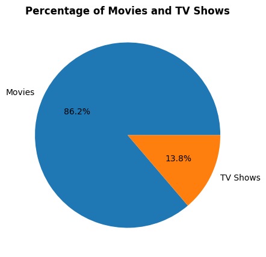

# Project Name - Amazon Prime Exploratory Data Analysis

## Project Overview
This project analyzes the Amazon Prime Movies and TV Shows dataset to explore content distribution, genre trends, ratings, and release patterns. The goal is to extract useful insights using data analysis and visualization techniques.

## Objectives
- Analyze the distribution of movies vs TV shows
- Identify the most common genres
- Study release year trends
- Explore ratings distribution
- Find top producing countries

## Dataset
Source: 
 - credits dataset - https://drive.google.com/file/d/1WbqSLOYIIOYVYxRvfmDUX3lBVvZ3fjtc/view?usp=sharing
 - titles dataset - https://drive.google.com/file/d/119vSf0U5goTWYtqo6cHUdbZAYrQ6Z83D/view?usp=sharing

Main Columns:
- id
- title
- type
- description
- release_year
- age_certification
- runtime
- genres
- production_countries
- seasons
- imdb_id
- imdb_score
- imdb_votes
- tmdb_popularity
- tmdb_score Duration
- person_id
- id
- name
- character
- role

## Tools and Technologies
- Python
- Pandas
- NumPy
- Matplotlib
- Seaborn
- Google Colab

## Data Cleaning
- Removed missing values
- Converted date columns to proper format
- Standardized genre and country values
- Removed duplicate records

## Exploratory Data Analysis (EDA)
Key analyses performed:
- Movies vs TV Shows distribution
- Top 10 genres
- Content added per year
- Ratings distribution
- Top countries producing content

## Key Insights
- Movies make up the majority of Amazon Prime content.
- Drama and Comedy are the most common genres.
- Content addition increased significantly after 2015.
- Most titles are rated for mature audiences.

## Future Improvements
- Perform sentiment analysis on reviews
- Build a recommendation system
- Create an interactive dashboard in Power BI

## Movies vs TV Shows Distribution

## Author
Santanu Jana

Aspiring Data Analyst skilled in Python, SQL, Power BI, and Excel.
